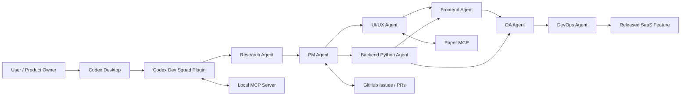
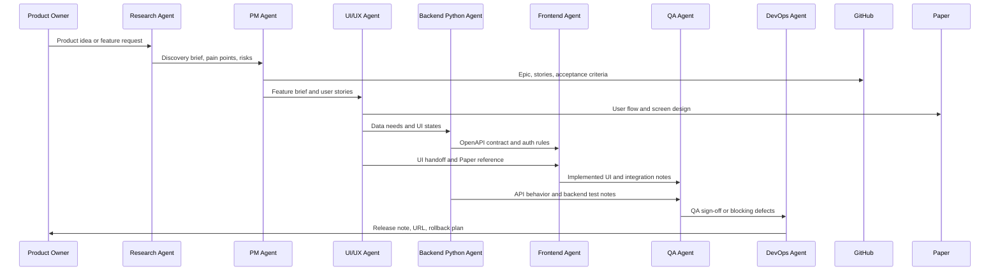
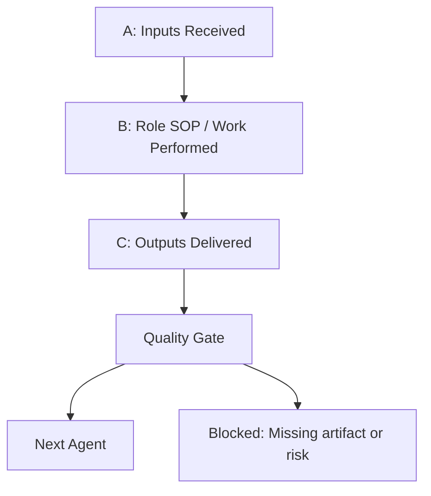

# Codex Dev Squad

Codex Dev Squad is a local Codex plugin that packages a small production software team into role-based skills, SOPs, workflows, templates, and a lightweight MCP server.

It is designed for builders who want Codex to behave less like a single coding assistant and more like a compact software delivery squad:

```text
Research -> PM -> UI/UX -> Backend Python -> Frontend -> QA -> DevOps
```

## Why This Exists

Small SaaS products often fail because the work jumps from an idea straight into code. Codex Dev Squad adds the missing operating layer: discovery, product planning, design handoff, API contracts, implementation plans, QA gates, and release readiness.

The plugin gives Codex a shared team language:

- **Skills** define each role's SOP.
- **Workflows** define how roles collaborate.
- **Templates** define the artifacts passed between roles.
- **MCP tools** expose role, workflow, template, and doc lookup.
- **GitHub + Paper** act as the collaboration and design surfaces.

## What Is Included

- 7 role skills:
  - Research Agent
  - PM Agent
  - UI/UX Agent
  - Backend Python Agent
  - Frontend Agent
  - QA Agent
  - DevOps Agent
- Feature workflows and agent SOPs.
- GitHub and Paper integration guidance.
- Templates for PRDs, GitHub issues, UI handoff, API contracts, QA plans, bug reports, and release notes.
- A local MCP server that exposes role, workflow, template, and documentation lookup tools.

## Interaction Model



## Feature Sequence Flow



## Handoff Contract

Every agent follows the same A/B/C handoff pattern:



Examples:

- PM cannot hand off unclear acceptance criteria.
- UI/UX cannot hand off without screen states and data needs.
- Backend cannot hand off without API contract and permission rules.
- QA cannot sign off without mapping tests to acceptance criteria.
- DevOps cannot deploy without QA sign-off or explicit accepted risk.

## Default Stack

- Collaboration: GitHub Issues, Projects, Pull Requests, Releases.
- Design: Paper MCP.
- Frontend: Next.js, React, TypeScript, Tailwind CSS, shadcn/ui.
- Backend: Python, FastAPI, Pydantic, PostgreSQL, SQLAlchemy/SQLModel, Alembic.
- API Contract: OpenAPI.
- QA: Playwright, Pytest.
- DevOps: Docker, GitHub Actions.

## Repository Structure

```text
.
|-- .agents/plugins/marketplace.json
`-- plugins/codex-dev-squad
    |-- .codex-plugin/plugin.json
    |-- .mcp.json
    |-- skills/
    |-- workflows/
    |-- templates/
    |-- docs/
    |-- assets/
    `-- scripts/
```

## Quickstart

Clone the repository:

```powershell
git clone https://github.com/rzladitya/codex-dev-squad.git
cd codex-dev-squad
```

Validate the plugin:

```powershell
python .\plugins\codex-dev-squad\scripts\validate_plugin.py
```

Expected output:

```text
Codex Dev Squad plugin scaffold is valid.
```

## Install Locally in Codex

Detailed instructions:

[Installation Guide](plugins/codex-dev-squad/docs/installation-guide.md)

Short version:

1. Copy or keep the plugin at `~/plugins/codex-dev-squad`.
2. Register a local marketplace at `~/.agents/plugins/marketplace.json`.
3. Add the marketplace and plugin enablement to `~/.codex/config.toml`.
4. Restart Codex Desktop.
5. Search for `Codex Dev Squad` in the plugin marketplace.

Example marketplace entry:

```json
{
  "name": "codex-dev-squad",
  "source": {
    "source": "local",
    "path": "./plugins/codex-dev-squad"
  },
  "policy": {
    "installation": "AVAILABLE",
    "authentication": "ON_INSTALL"
  },
  "category": "Productivity"
}
```

Example Codex config:

```toml
[plugins."codex-dev-squad@local-dev"]
enabled = true

[marketplaces.local-dev]
source_type = "local"
source = 'C:\Users\<your-user>'
```

## Usage SOP

Daily operating guide:

[Usage SOP](plugins/codex-dev-squad/docs/usage-sop.md)

Example prompt:

```text
Use Codex Dev Squad to run an end-to-end feature-development plan for User Authentication.

Do not implement code yet.
Produce:
- Research discovery brief
- PM GitHub-ready issues
- UI/UX Paper handoff plan
- Backend Python API contract
- Frontend implementation plan
- QA test plan
- DevOps release checklist
- Handoff records between all agents
```

## MCP Tools

The plugin MCP server exposes:

- `list_roles`
- `list_workflows`
- `list_templates`
- `list_role_skills`
- `list_docs`
- `get_role_skill`
- `get_workflow`
- `get_template`
- `get_doc`

## GitHub And Paper

Codex Dev Squad is designed to use existing Codex integrations first:

- PM and engineering agents use the GitHub connector or GitHub CLI where available.
- UI/UX Agent uses Paper MCP for live design work and Paper handoff.
- Connector limitations and fallback rules are documented in [Codex Tool Integrations](plugins/codex-dev-squad/docs/codex-tool-integrations.md).

## Public Usage Notes

This repository is meant to be a starting point. You can:

- Fork it and customize the role SOPs.
- Add your preferred frontend/backend stack.
- Add more workflow templates.
- Replace the default SaaS flow with your own software delivery process.
- Extend the MCP server with more tools.

## License

This project is licensed under the MIT License. See [LICENSE](LICENSE).

